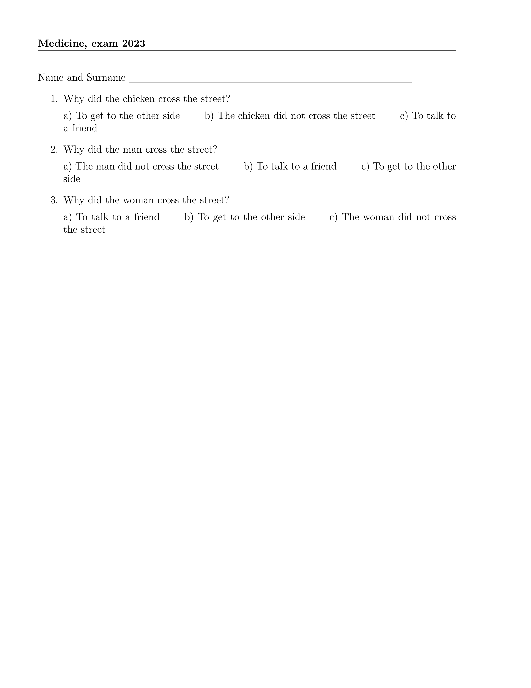
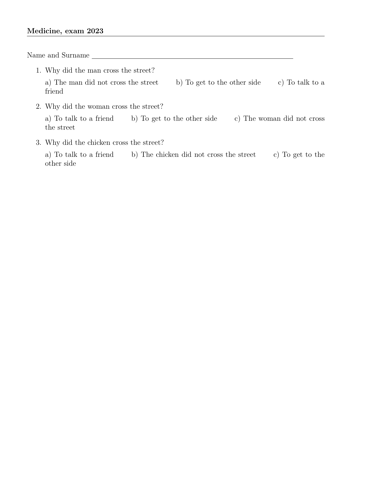

# testbuilder

## What it is?
A small app for building tests in **LaTeX** from tests in the following form 

Why did the chicken cross the street? 
A) To talk to a friend 
B) To get to the other side 
C) The chicken did not cross the street 
ANSWER B

There should be many such questions, of course. Check out the example in the "example_test.txt"

The application will shuffle the order of the questions and also the order inside the answer - what was A will become e.g. C etc. 

You will get a nice looking test sheet after compiling with (pdf)LaTeX. 

## How to use it

Download the binary for your operating system and run providing the sourcefile with the test in the above format, the output file name (say, "test" will get you a bunch of LaTeX files: "test1.tex", "test2.tex" etc. -- this can also include full path if you want to save the files and test.sty in a specific location), the number of different tests you want to generate, the title of the test (e.g. Medicine exam 2023) and what should go before the beginning of the test, usually something like: Name, Surname ________________________

Example usage:
`./tb example_test.txt res_test 8 "Medicine exam 2023" "Name and Surname \underline{\hspace{11.5cm}}"`

This will output 8 LaTeX files named from `res_test1.tex` to `res_test8.tex` and the LaTeX style file `test.sty` to help with the compilation. All the files will have different orders, so the first resulting pdf may look like this:

and the third like this:

